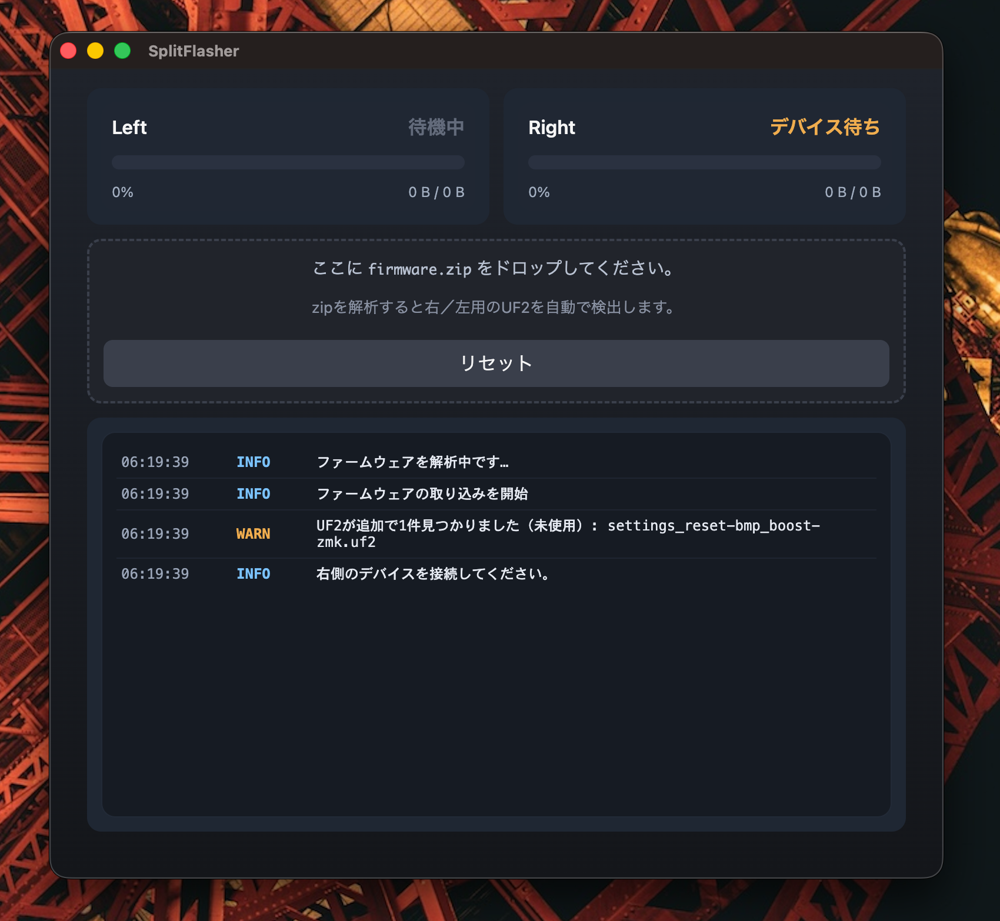

# SplitFlasher

UF2 ファームウェア zip を左右の分割キーボードへ安全にフラッシュする Electron + React (Vite) アプリです。



> `docs/SplitFlasher.png` は本リポジトリに同梱済みです。

## 主な機能
- zip 内の UF2 を自動判別し、右 → 左の順でコピー。
- 同一デバイスの再マウントを 10 秒間無視して誤コピーを防止。
- ログビューで進捗・警告を確認。

## 環境
- Node.js 20 以上推奨
- npm
- macOS での動作を想定（`diskutil` を使用）

## セットアップ
```sh
npm ci
```

## 使い方
1. アプリを起動: `npm run dev`（開発）またはビルド済みバイナリを実行。
2. `firmware.zip` をウィンドウ中央にドラッグ＆ドロップ。
3. 右側デバイスを接続 → 書き込み完了後に左側を接続。
4. ログに完了メッセージが出たら終了。必要なら「リセット」で再実行。

### ファームウェア zip の想定
- 右・左それぞれの UF2 を同梱（ファイル名で側を判別）。
- 余分な UF2 が含まれる場合は WARN ログに表示。

## ビルド
```sh
npm run build
```
- 生成物は `dist/` 配下（メイン/プリロード/レンダラー）。

## 配布（GitHub Actions）
- タグ `v*` を push すると `.github/workflows/release.yml` が動き、`dist/` を ZIP 化して GitHub Release に添付します。
- 手動実行したい場合は Actions から `workflow_dispatch` を選択。

## 開発メモ
- 開発サーバー: `npm run dev`
- 型チェック: `npm run lint`

## ディレクトリ構成
- `src/main.ts` メインプロセス（ボリューム監視・zip 展開・UF2 コピー）
- `src/preload.ts` Renderer との IPC ブリッジ
- `src/renderer/` React UI
- `public/` Vite エントリ HTML
- `docs/SplitFlasher.png` README 用スクリーンショット（任意）

## ライセンス
MIT
